# Meteor Mayhem

<p align="center">
  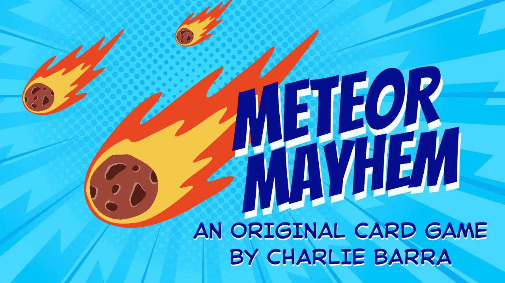
</p>

<p align="center">
  <strong>An original multiplayer strategy card game by Charlie Barra</strong>
</p>

<p align="center">
  <a href="https://charliebarra.github.io/portfolio/meteor-mayhem.html">View Full Case Study</a>
  ·
  <a href="https://youtu.be/q08nESroUwM">Watch Video Walkthrough</a>
  ·
  <a href="printable-files/meteor-mayhem-card-sheets.pdf">View Printable Card Sheets</a>
</p>

---

## Overview

Meteor Mayhem is an original tabletop strategy game about mining resources from a meteor, upgrading ships, managing risk, and disrupting opponents through events and hazards.

I developed the project from early planning through a playable prototype. The process included research, mechanic design, card creation, rules development, probability thinking, playtesting, balancing, and reflection.

## My Role

- Lead Designer and Creator
- Game Systems Design
- Card and Rules Design
- Resource Economy
- Balance and Iteration
- Physical Prototyping
- Playtesting
- Probability Analysis

## Design Challenge

**Can luck matter without deciding who wins?**

I wanted the game to feel strategic and unpredictable at the same time. Players needed to make meaningful decisions about timing, risk, upgrades, defense, and interaction. The challenge was keeping uncertainty exciting without making the outcome feel random.

## Design Goals

- Create meaningful player choices
- Support more than one viable strategy
- Make the rules approachable
- Keep turns moving
- Use randomness to create situations, not predetermined outcomes
- Encourage player interaction without removing agency

## Process

### 1. Research

I studied games with resource systems, upgrades, risk-versus-reward decisions, and direct player interaction.

### 2. Ideation

I brainstormed card types, hazards, disasters, scoring, ship upgrades, and possible win conditions.

### 3. Prototype

I built a physical prototype using custom cards and components.

### 4. Playtesting

I watched how real players interpreted the rules, managed resources, and found strategies I had not expected.

### 5. Iteration

I revised card effects, pacing, balance, and clarity based on testing and feedback.

## Process Gallery

| Planning | Proposal | Brainstorming |
|---|---|---|
| 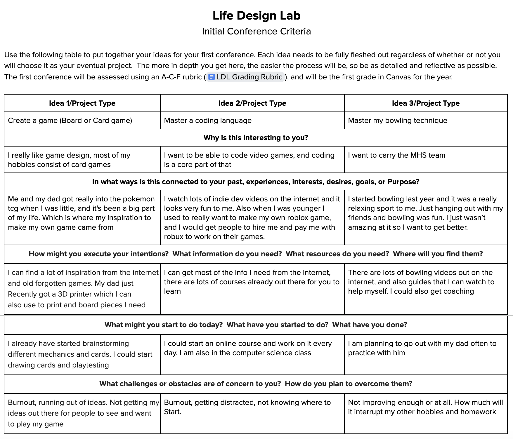 | 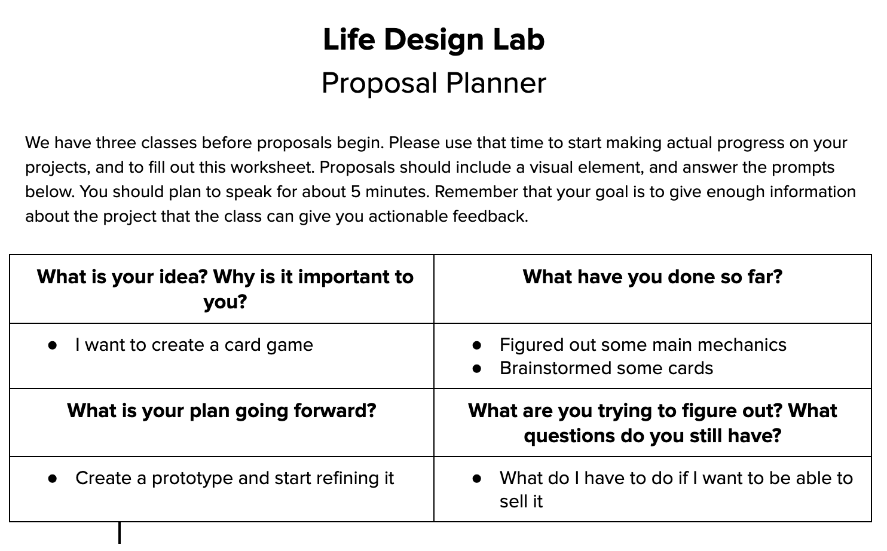 | 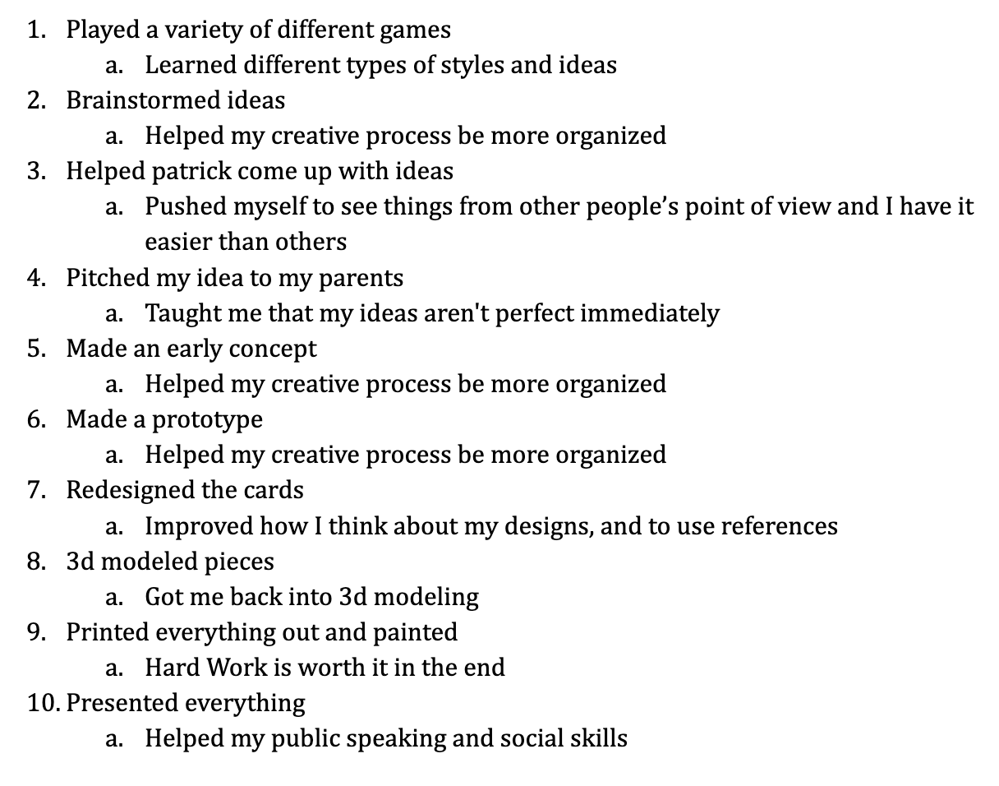 |

| Design Process | Card Ideas | Reflection |
|---|---|---|
| 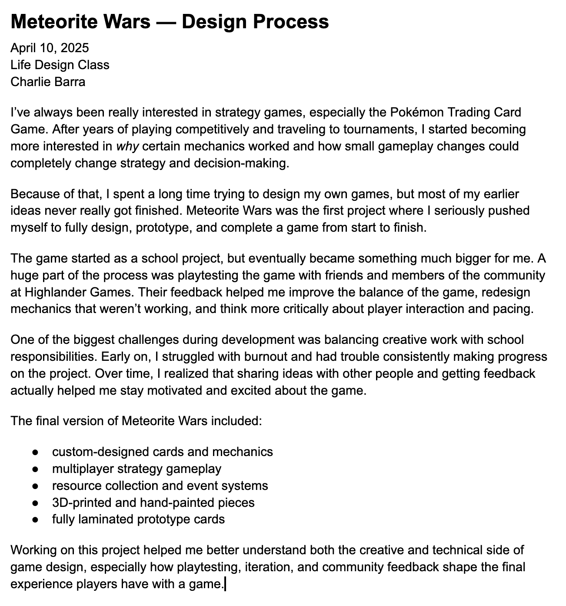 | 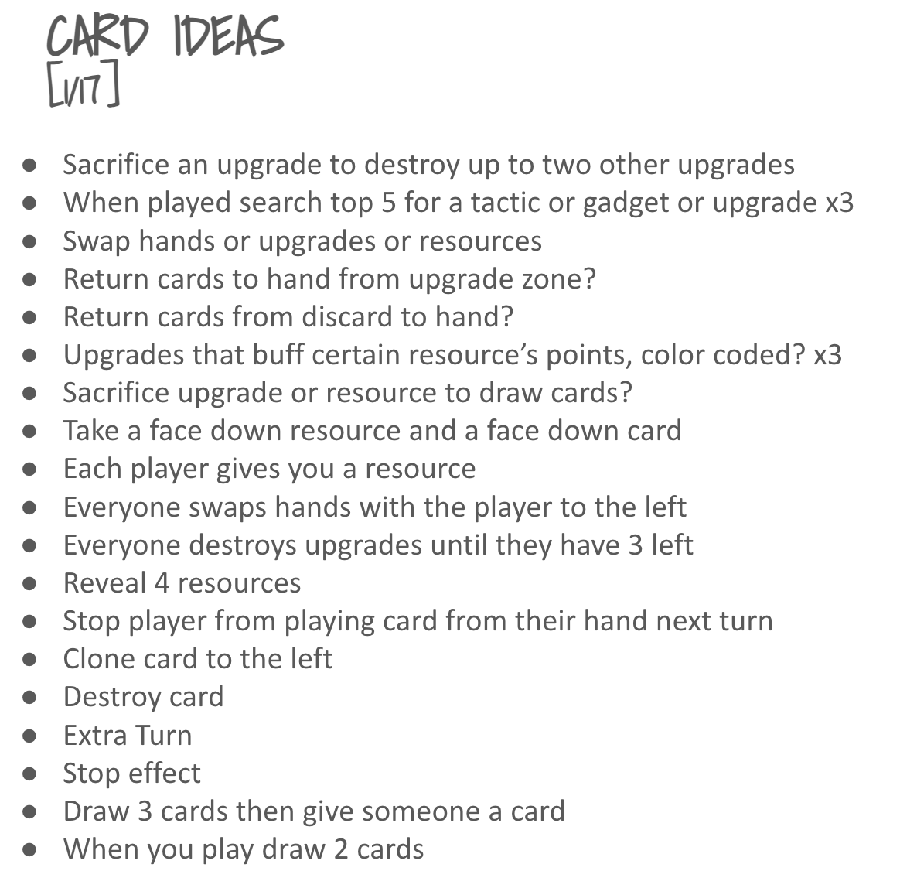 | 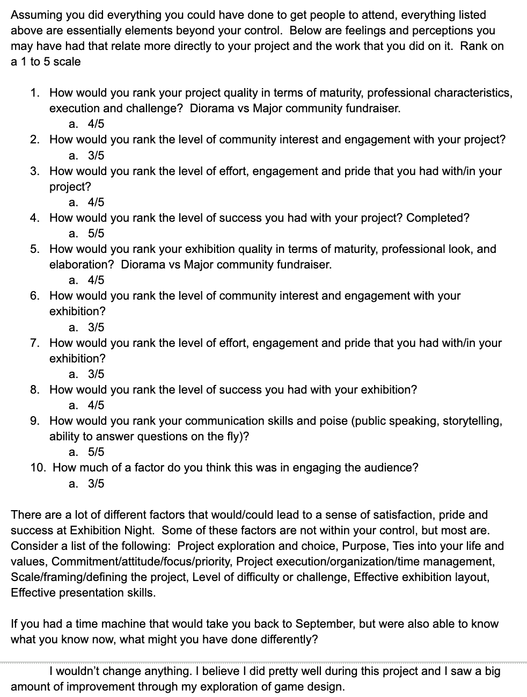 |

## Card System

The card layouts use consistent categories and visual rules so players can understand effects quickly and spend more time making decisions.

| Card Sheet 1 | Card Sheet 2 |
|---|---|
| 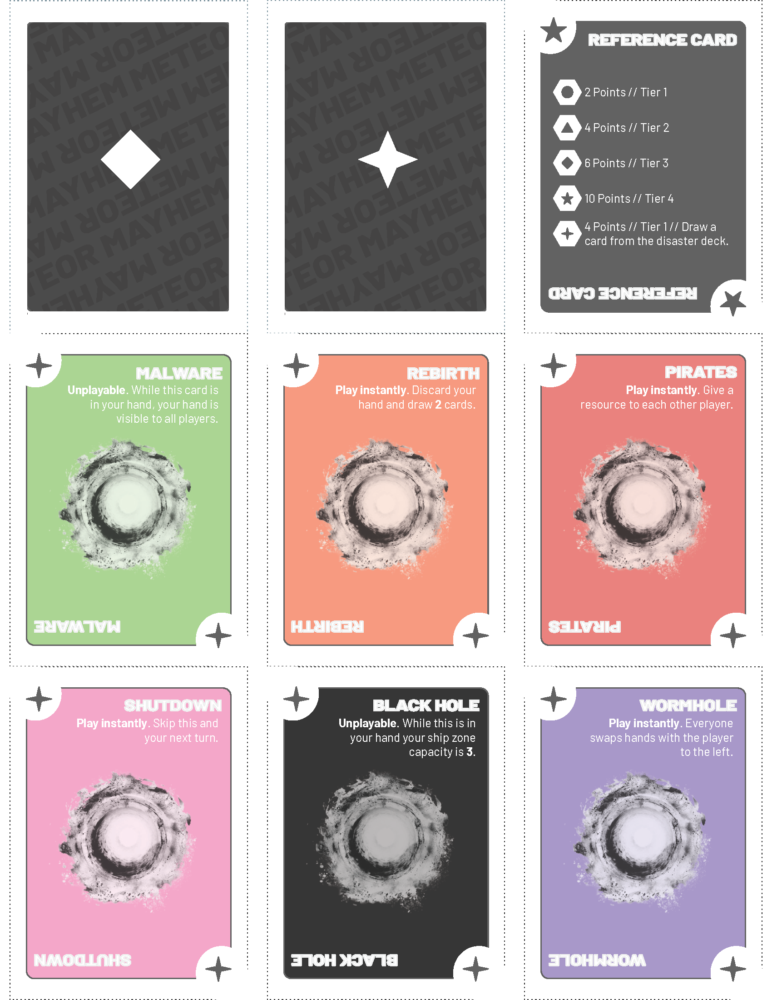 | 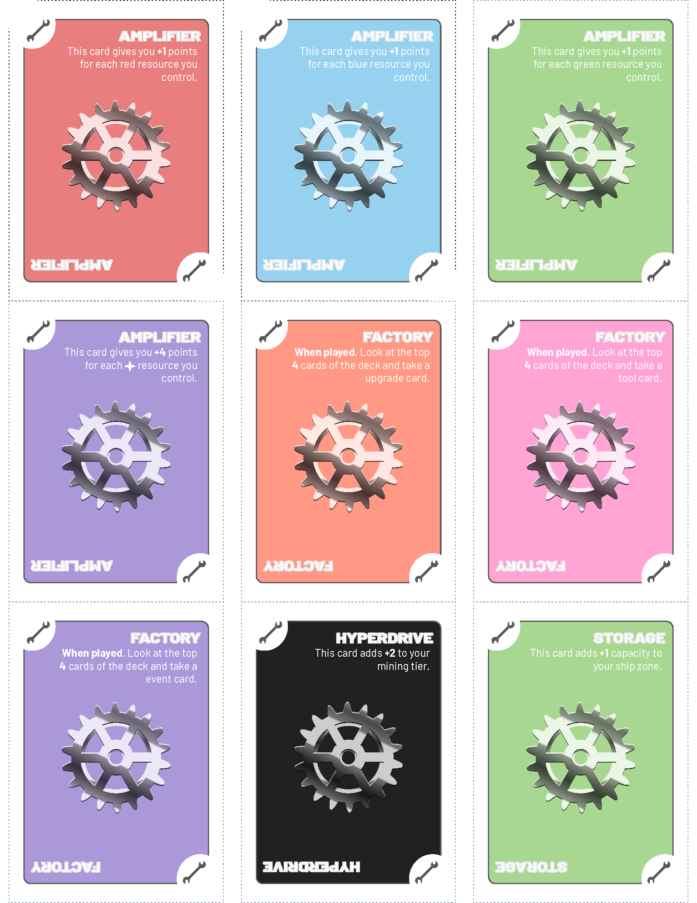 |

| Card Sheet 3 | Card Sheet 4 |
|---|---|
| 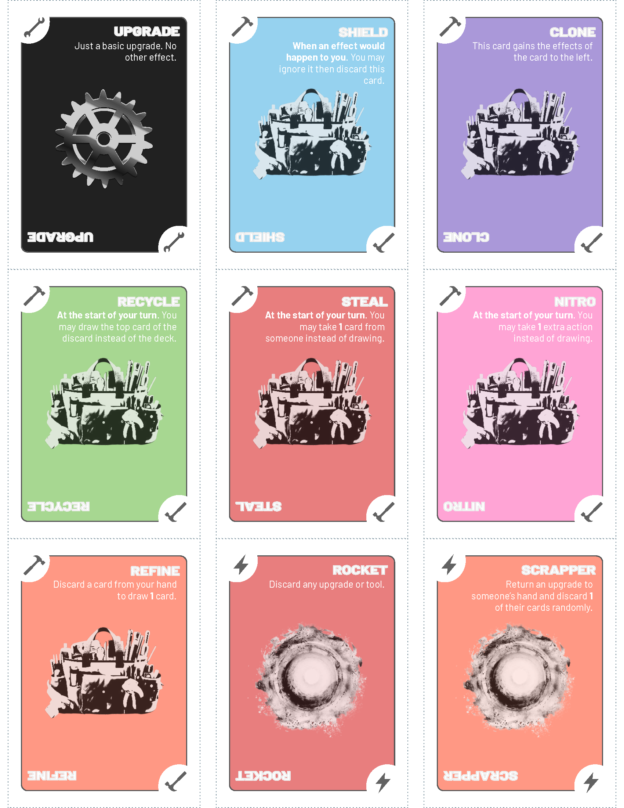 | 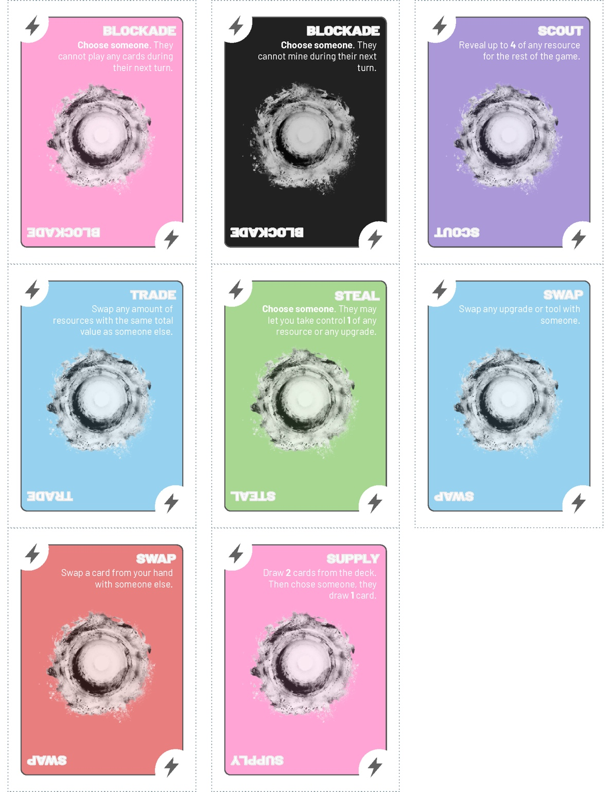 |

## What Playtesting Changed

Playtesting showed me that players do not always use a system the way the designer expects. Some strategies were stronger than I predicted, and some rules that felt obvious to me were unclear to new players.

The most useful changes came from watching players rather than trying to explain the intended experience.

## What I Learned

- A complete game is a connected system, not a collection of individual mechanics.
- Clear rules give players more room to think strategically.
- Probability can guide balance, but player experience determines whether balance feels fair.
- Removing a mechanic can improve a design more than adding another one.
- Iteration is where an idea becomes an experience.

## Next Version

If I continue development, I would:

- Test with a larger group of players
- Refine card distribution and balance
- Improve component quality
- Create a more concise rulebook
- Explore a digital prototype
- Track playtest data more systematically

## Repository Guide

```text
meteor-mayhem/
├── README.md
├── assets/
│   ├── hero/
│   ├── process/
│   ├── cards/
│   └── gameplay/
├── documentation/
│   ├── design-process/
│   ├── playtesting/
│   ├── reflections/
│   └── rules/
├── probability/
└── printable-files/
```

## Related Links

- **Portfolio:** https://charliebarra.github.io/portfolio/
- **Full Case Study:** https://charliebarra.github.io/portfolio/meteor-mayhem.html
- **Video Walkthrough:** https://youtu.be/q08nESroUwM

---

> **Curious about systems. Passionate about building better ones.**
