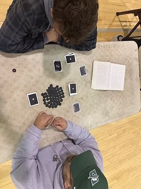
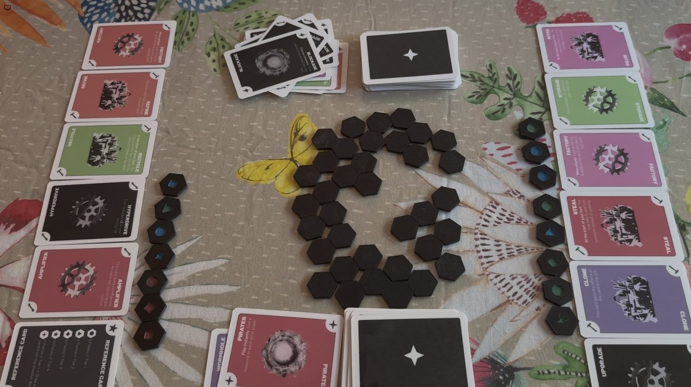

# Meteor Mayhem

<p align="center">
  
</p>

<p align="center">
  <strong>An original multiplayer strategy card game by Charlie Barra</strong>
</p>

<p align="center">
  <a href="https://charliebarra.github.io/portfolio/meteor-mayhem.html">Full Portfolio Case Study</a>
  ·
  <a href="https://youtu.be/q08nESroUwM">Video Walkthrough</a>
  ·
  <a href="printable-files/meteor-mayhem-card-sheets.pdf">Printable Card Sheets</a>
</p>

---

## The Question

**Can luck matter without deciding who wins?**

I wanted Meteor Mayhem to be unpredictable without making players feel like their choices did not matter. Players had to decide when to take a risk, upgrade, defend, or interfere with someone else.

That sounded straightforward until people actually started playing it.

## What I Built

Meteor Mayhem is a multiplayer tabletop strategy game about mining resources from a meteor, upgrading ships, surviving hazards, and competing with other players.

I designed the:

- rules and turn structure,
- cards and card categories,
- resource economy,
- ship upgrades,
- hazards and events,
- physical prototype,
- playtesting process,
- and card-frequency approach used during balancing.

**Role:** Sole Designer & Creator  
**Status:** Playable physical prototype  
**Developed through:** Life Design Lab independent honors project

## How the Game Developed

The project did not move in a straight line.

1. I researched resource systems, upgrades, risk, and player interaction.
2. I filled pages with cards, hazards, scoring ideas, and several win conditions.
3. I built a physical version so people could finally test it.
4. Players found confusing rules and strategies I had not expected.
5. I changed card effects, costs, pacing, and instructions.
6. Then I tested it again.

The prototype was useful because it answered questions. It did not need to look finished yet.

## Process Gallery

| Early Planning | Proposal | Brainstorming |
|---|---|---|
|  |  |  |

| Design Process | Card Ideas | Self-Evaluation |
|---|---|---|
|  |  |  |

## Playtesting

I already knew how the game was supposed to work. That was the problem.

New players noticed things I could no longer see because I already knew what every rule and card was meant to do. Watching them play taught me much more than repeatedly explaining what I intended.

| Early Prototype Setup | Balancing in Progress |
|---|---|
|  |  |
| Testing the card system, resource pieces, and how quickly players understood the table. | Watching what players saved, spent, and completely ignored. |

### Things Players Taught Me

#### Players saved everything

I expected players to spend fuel and resources whenever they needed them. Instead, many saved everything because they worried they would need it later.

The players were not making bad decisions. The rules were teaching them to hoard.

#### One strategy became too strong

I wanted several ways to win. Once someone found the strongest approach, other players started copying it.

I adjusted costs and made other strategies more rewarding. The goal was not to remove a good strategy. I just did not want it to be the only good one.

#### The rulebook made sense—to me

Different players asked the same questions because I had skipped steps that felt obvious.

Knowing the answer makes it surprisingly difficult to remember what a new player does not know yet.

#### Players tried things I never expected

Some players took risks early. Others ignored upgrades I thought everyone would want. Someone built a strategy around a card I had barely considered.

Players do not need the designer’s permission to be creative.

#### Small changes had large effects

Changing one cost, one resource, or one number could completely change what players decided to do.

Apparently, “balanced” is harder than it looks.

More detailed notes are in [`documentation/playtesting/Playtesting Journal.md`](documentation/playtesting/Playtesting%20Journal.md).

## Probability and Balancing

I used probability and card-frequency counts to think about how often different effects appeared.

That gave me a starting point, but the numbers could not tell me:

- whether a decision felt interesting,
- whether players understood the risk,
- whether one strategy made every other choice pointless,
- or whether people wanted to play again.

The working balance document is in [`probability/Balance Notes.md`](probability/Balance%20Notes.md).

## Card System

I used consistent layouts and categories so players could understand cards without stopping the game every turn.

| Card Sheet 1 | Card Sheet 2 |
|---|---|
|  |  |

| Card Sheet 3 | Card Sheet 4 |
|---|---|
|  |  |

[View the printable card-sheet PDF](printable-files/meteor-mayhem-card-sheets.pdf)

## Something That Surprised Me

The game in my head was not always the game other people experienced.

Players use the rules that are actually there—not the rules I thought I had written. The most useful changes came from watching people play instead of explaining what I meant.

## What I Would Change Next

With more development time, I would:

- test with more people who have never heard me explain the rules,
- track playtest results more systematically,
- refine card frequency and resource costs,
- create a shorter and clearer rulebook,
- explore asymmetric ships or player powers,
- and build a small digital balancing tool.

I am still wondering how much randomness feels exciting before it starts feeling unfair.

## Repository Guide

```text
meteor-mayhem/
├── README.md
├── assets/
│   ├── hero/
│   ├── process/
│   ├── cards/
│   └── playtesting/
├── documentation/
│   ├── design-process/
│   ├── playtesting/
│   ├── reflections/
│   └── rules/
├── probability/
└── printable-files/
```

### Documentation

- [Design Process](documentation/design-process/Design%20Process.md)
- [Playtesting Journal](documentation/playtesting/Playtesting%20Journal.md)
- [Playtesting Log Template](documentation/playtesting/Playtesting%20Log.md)
- [Project Reflection](documentation/reflections/Reflection.md)
- [Working Rules Document](documentation/rules/Official%20Rules.md)
- [Probability and Balance Notes](probability/Balance%20Notes.md)

## Related Links

- [Charlie Barra Portfolio](https://charliebarra.github.io/portfolio/)
- [Full Meteor Mayhem Case Study](https://charliebarra.github.io/portfolio/meteor-mayhem.html)
- [Video Walkthrough](https://youtu.be/q08nESroUwM)
- [Charlie’s GitHub Profile](https://github.com/charliebarra)

---

*I do not think the goal is to make a perfect first version. I think the goal is to build something useful enough to show you what question to ask next.*
