# Meteor Mayhem

<p align="center">
  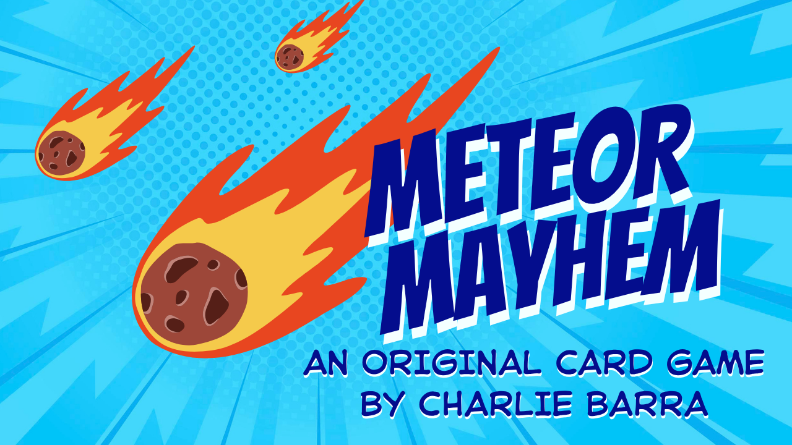
</p>

<p align="center">
  <strong>An original multiplayer strategy card game by Charlie Barra</strong>
</p>

<p align="center">
  <a href="https://www.charliebarra.com/meteor-mayhem.html">Full Portfolio Case Study</a>
  ·
  <a href="https://youtu.be/q08nESroUwM">Video Walkthrough</a>
  ·
  <a href="documentation/rules/Meteor-Mayhem-Rulebook.pdf">Rulebook (Prototype Edition)</a>
  ·
  <a href="documentation/balance/Meteor-Mayhem-Probability-and-Balance-Notes.pdf">Playtesting & Balance Questions</a>
  ·
  <a href="printable-files/meteor-mayhem-card-sheets.pdf">Printable Card Sheets</a>
</p>

---

## The Question

**Can luck matter without deciding who wins?**

I wanted Meteor Mayhem to be unpredictable without making players feel like their choices did not matter. Players had to decide when to take a risk, upgrade, defend, or interfere with someone else.

That sounded straightforward until people actually started playing it.

## What I Built

Meteor Mayhem is a multiplayer tabletop strategy game about mining resources from a meteor, upgrading ships, surviving hazards, and competing with other players.

I designed the:

- rules and turn structure,
- cards and card categories,
- resource economy,
- ship upgrades,
- hazards and events,
- physical prototype,
- playtesting process,
- and card-frequency approach used during balancing.

**Role:** Independent student game designer and prototype creator
**Duration:** Approximately 4 months  
**Status:** Playable physical prototype  
**Players:** 2–4  
**Play time:** 15–30 minutes  
**Tools:** Google Slides, physical prototyping, and playtesting  
**Developed through:** [Life Design Lab](https://mhs.morrisschooldistrict.org/academics/humanities-academy), an Honors-level program at Morristown High School

## How the Game Developed

The project did not move in a straight line.

1. I researched resource systems, upgrades, risk, and player interaction.
2. I filled pages with cards, hazards, scoring ideas, and several win conditions.
3. I built a physical version so people could finally test it.
4. Players found confusing rules and strategies I had not expected.
5. I changed card effects, costs, pacing, and instructions.
6. Then I tested it again.

The prototype was useful because it answered questions. It did not need to look finished yet.

## Process Gallery

| Early Planning | Proposal | Brainstorming |
|---|---|---|
| 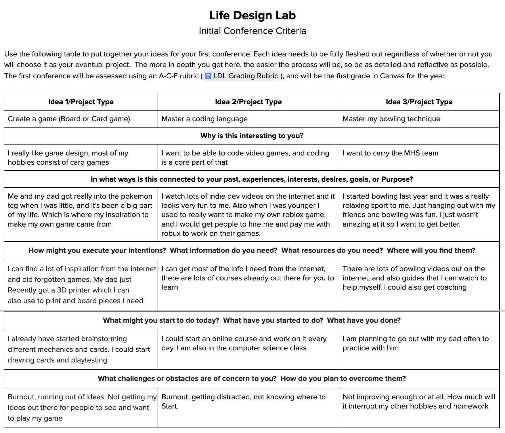 | 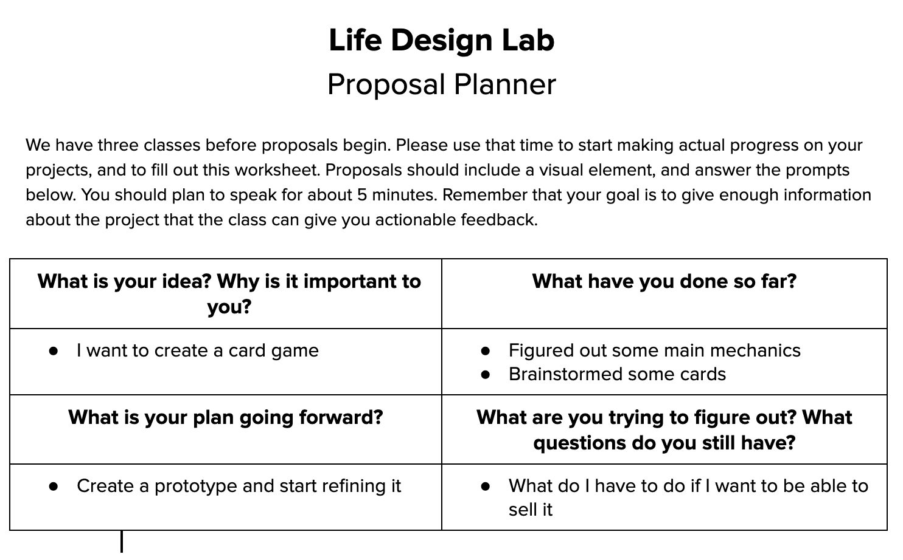 | 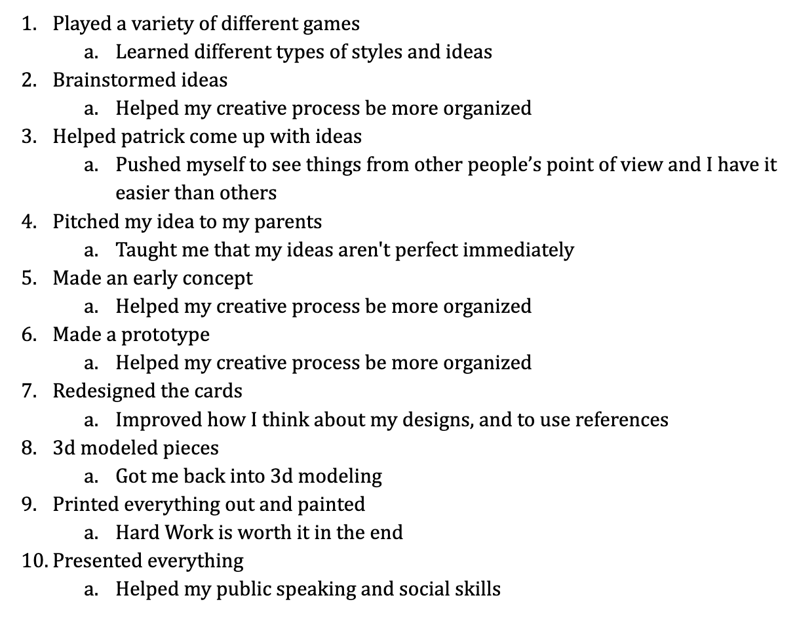 |

| Design Process | Card Ideas | Self-Evaluation |
|---|---|---|
| 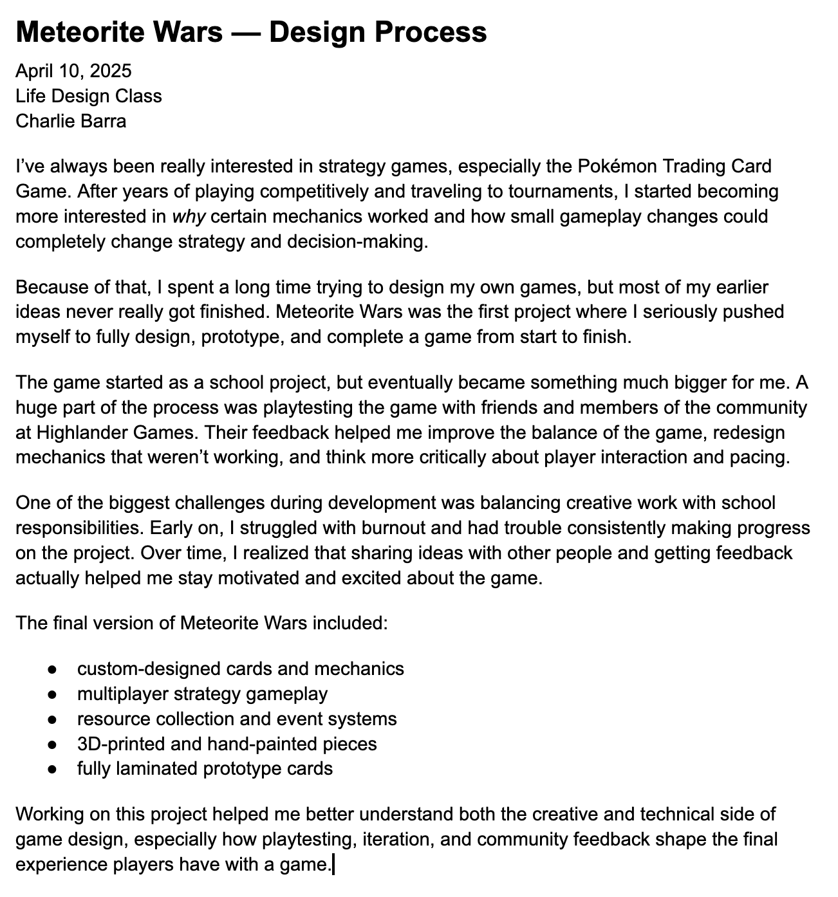 | 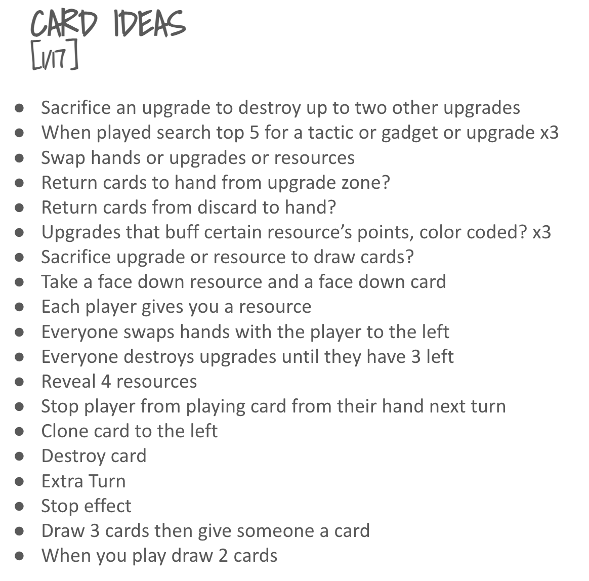 | 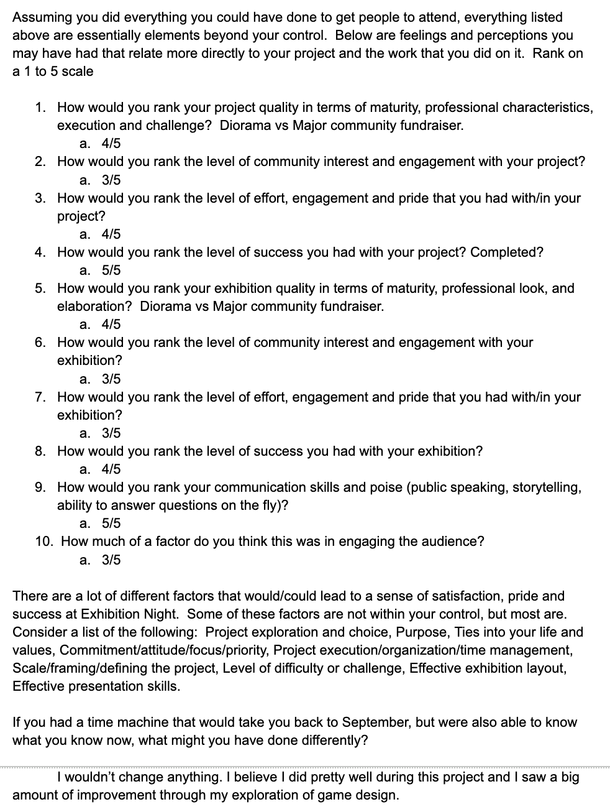 |

## Playtesting

I already knew how the game was supposed to work. That was the problem.

New players noticed things I could no longer see because I already knew what every rule and card was meant to do. Watching them play taught me much more than repeatedly explaining what I intended.

| Early Prototype Setup | Balancing in Progress |
|---|---|
| 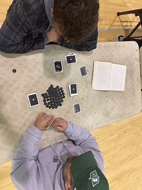 | 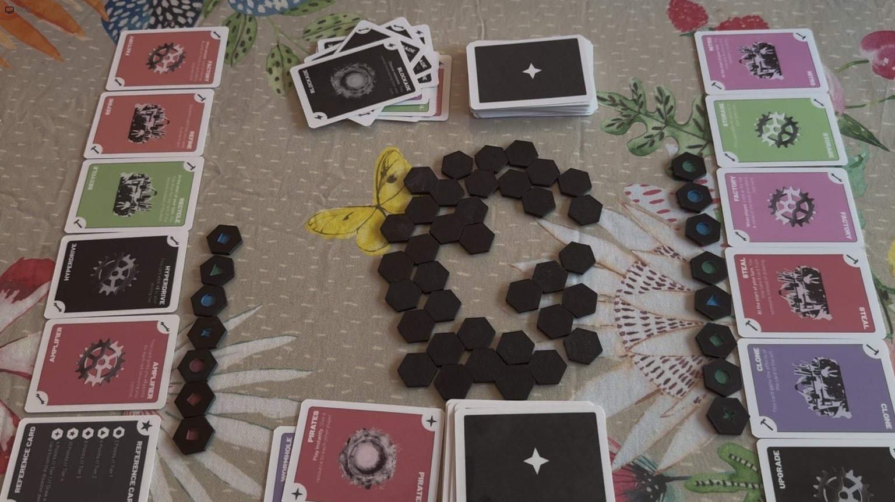 |
| Testing the card system, resource pieces, and how quickly players understood the table. | Watching what players saved, spent, and completely ignored. |

### Things Players Taught Me

#### Players saved everything

I expected players to spend fuel and resources whenever they needed them. Instead, many saved everything because they worried they would need it later.

The players were not making bad decisions. The rules were teaching them to hoard.

#### One strategy became too strong

I wanted several ways to win. Once someone found the strongest approach, other players started copying it.

I adjusted costs and made other strategies more rewarding. The goal was not to remove a good strategy. I just did not want it to be the only good one.

#### The rulebook made sense—to me

Different players asked the same questions because I had skipped steps that felt obvious.

Knowing the answer makes it surprisingly difficult to remember what a new player does not know yet.

#### Players tried things I never expected

Some players took risks early. Others ignored upgrades I thought everyone would want. Someone built a strategy around a card I had barely considered.

Players do not need the designer’s permission to be creative.

#### Small changes had large effects

Changing one cost, one resource, or one number could completely change what players decided to do.

Apparently, “balanced” is harder than it looks.

More detailed notes are in [`documentation/playtesting/Playtesting Journal.md`](documentation/playtesting/Playtesting%20Journal.md).

## From Prototype to Playable

Writing the rules down exposed missing steps and unclear wording. The current prototype rulebook is a working draft that I would test with players who have not heard me explain the game.

**[View the Meteor Mayhem Rulebook (Prototype Edition)](documentation/rules/Meteor-Mayhem-Rulebook.pdf)**

## Playtesting and Balance Questions

> “I never actually calculated exact probabilities. Instead, I wrote down the questions I wanted to answer while playtesting. That helped me decide what to change after each game.”

The questions focused my playtests on:

- how often high-impact cards should appear,
- how long it took to build a strong mining tier,
- whether several paths to victory remained viable,
- whether one strategy became dominant,
- and how much control players had over uncertainty.

The notes are intentionally honest. I wanted high-impact cards to appear often because the game is more fun when it is chaotic. At the same time, repeated play suggested that building the mining tier as quickly as possible could become the preferred strategy. Card selection and scouting gave players ways to respond to uncertainty, but the dominant-strategy question became something to keep testing.

**[View the Playtesting and Balance Questions](documentation/balance/Meteor-Mayhem-Probability-and-Balance-Notes.pdf)**

The working Markdown record is in [`documentation/balance/Balance Notes.md`](documentation/balance/Balance%20Notes.md).

## Card System

I used consistent layouts and categories so players could understand cards without stopping the game every turn.

| Card Sheet 1 | Card Sheet 2 |
|---|---|
| 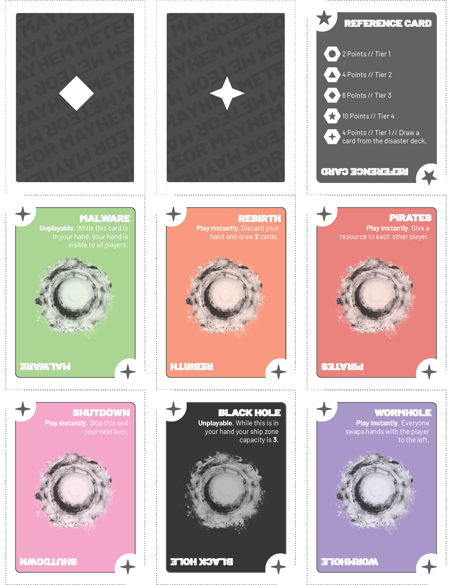 | 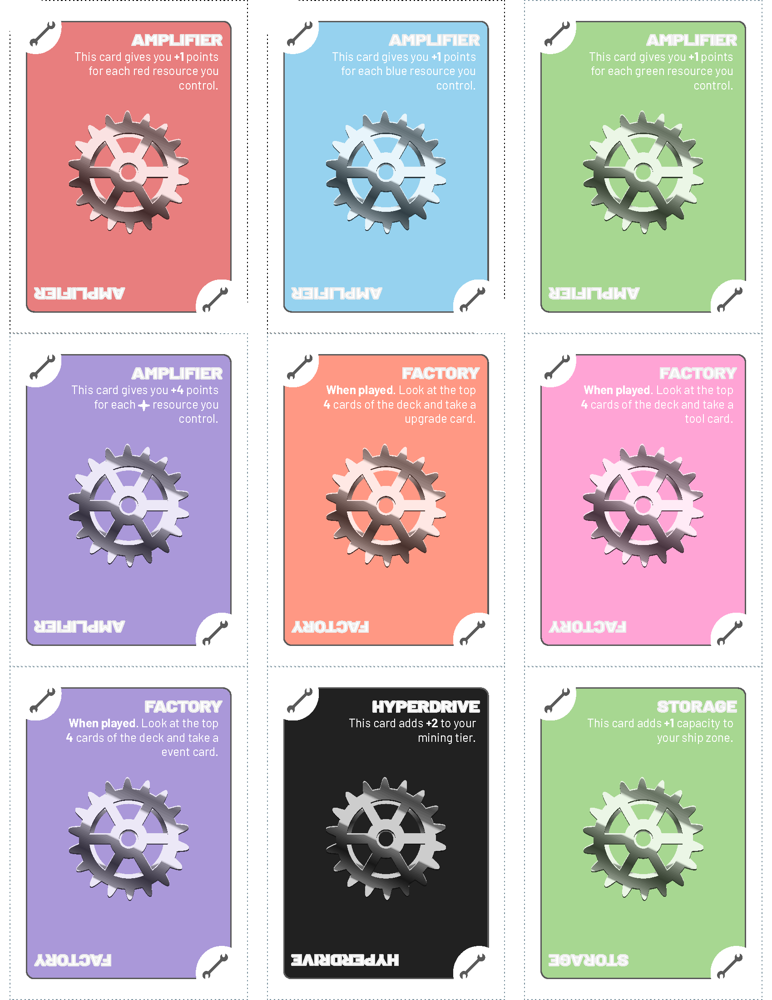 |

| Card Sheet 3 | Card Sheet 4 |
|---|---|
| 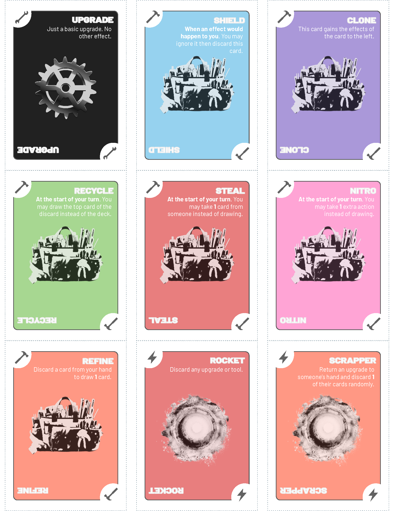 | 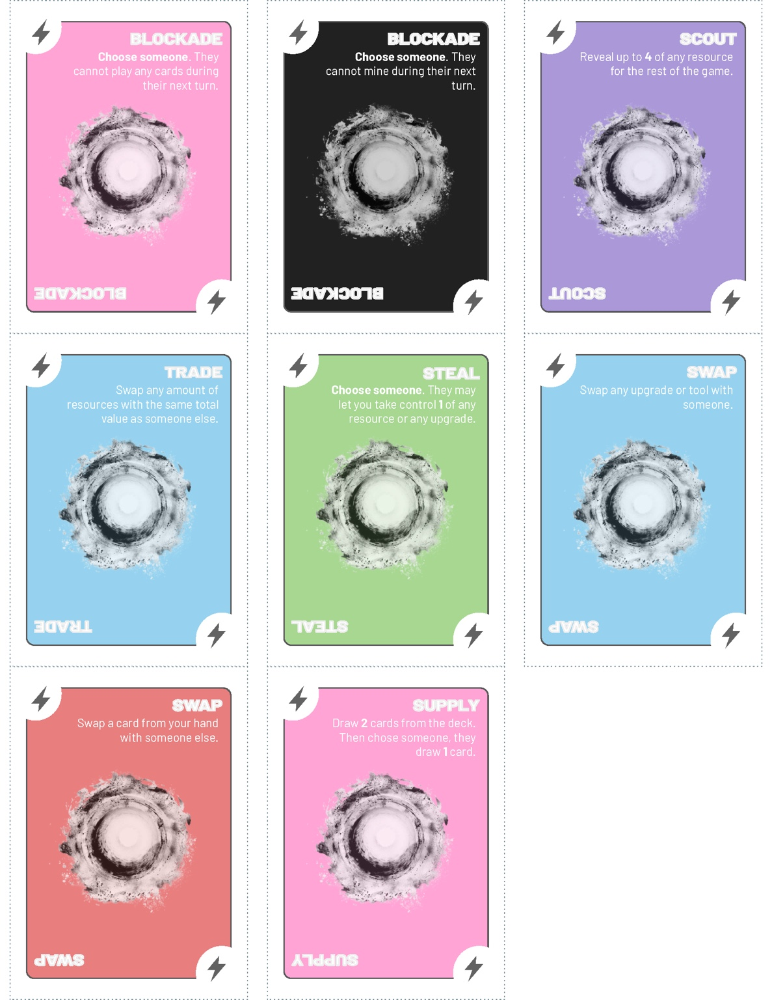 |

[View the printable card-sheet PDF](printable-files/meteor-mayhem-card-sheets.pdf)

### Player Reference Card

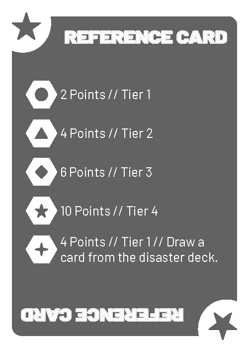

The reference card helps players check resource points, mining tiers, and when to draw from the disaster deck.

## Something That Surprised Me

The game in my head was not always the game other people experienced.

Players use the rules that are actually there—not the rules I thought I had written. The most useful changes came from watching people play instead of explaining what I meant.

## What I Would Change Next

With more development time, I would:

- test with more people who have never heard me explain the rules,
- track playtest results more systematically,
- refine card frequency and resource costs,
- revise the Prototype Edition when future playtests reveal unclear rules,
- explore asymmetric ships or player powers,
- and build a small digital balancing tool.

I am still wondering how much randomness feels exciting before it starts feeling unfair.

## Repository Guide

```text
meteor-mayhem/
├── README.md
├── assets/
│   ├── hero/
│   ├── process/
│   ├── cards/
│   └── playtesting/
├── documentation/
│   ├── design-process/
│   ├── playtesting/
│   ├── reflections/
│   ├── rules/
│   └── balance/
└── printable-files/
```

### Production Artifacts

- [Design Process](documentation/design-process/Design%20Process.md)
- [Playtesting Journal](documentation/playtesting/Playtesting%20Journal.md)
- [Meteor Mayhem Rulebook (Prototype Edition)](documentation/rules/Meteor-Mayhem-Rulebook.pdf)
- [Playtesting & Balance Questions](documentation/balance/Meteor-Mayhem-Probability-and-Balance-Notes.pdf)
- [Balance Notes - accessible Markdown](documentation/balance/Balance%20Notes.md)
- [Playtesting Log Template](documentation/playtesting/Playtesting%20Log.md)
- [Project Reflection](documentation/reflections/Reflection.md)

### Rulebook Version History

- **Prototype Edition** — current rulebook for the playable prototype.
- **Future revisions** — will be documented here when additional testing leads to meaningful changes.

## Related Links

- [Charlie Barra Portfolio](https://www.charliebarra.com/)
- [Full Meteor Mayhem Case Study](https://www.charliebarra.com/meteor-mayhem.html)
- [Video Walkthrough](https://youtu.be/q08nESroUwM)
- [Charlie’s GitHub Profile](https://github.com/charliebarra)

---

*I do not think the goal is to make a perfect first version. I think the goal is to build something useful enough to show you what question to ask next.*

## Repository Context

This repository was assembled in July 2026 from original design files, rules, cards, photographs, and project documentation for portfolio review. Its Git history records archival organization and later documentation updates, not Meteor Mayhem's original development timeline. The dated process materials, playtesting records, and prototype artifacts provide the evidence of how the game developed.
